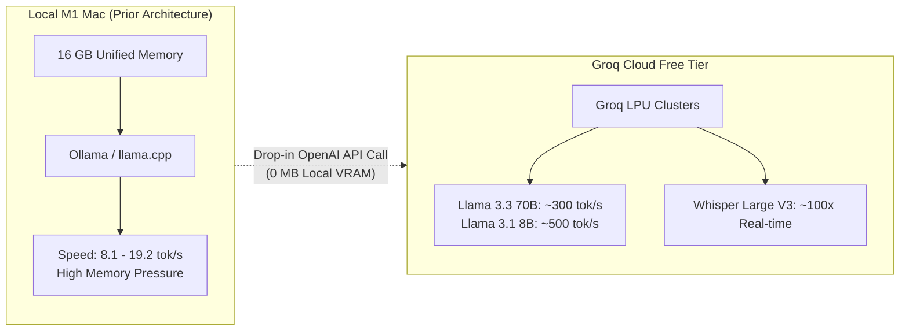

# Accelerating AI Workloads: Free-to-Use Cloud Services Guide

> [!NOTE]
> **Context:** On Apple Silicon (such as a Mac mini M1 with 16 GB unified RAM), local inference achieves ~8.1 tok/s with 9B models (`qwen3.5:9b`), ~19.2 tok/s with 4B models (`translategemma:4b`), and risks Metal GPU buffer OOM errors when loading larger models or dual draft models.
> 
> Migrating heavy translation batches, Hebrew quality evaluation suites, and ASR (speech-to-text) to free-tier cloud accelerators yields **30× to 50× speedups (300–1,500+ tok/s)** with zero local RAM impact.

---

## 1. Quick Comparison Matrix

| Service | LLM Speed | Best Free Models | Free ASR (Whisper)? | Free Quota | Best Suited For |
| :--- | :---: | :--- | :---: | :--- | :--- |
| **[Groq Cloud](https://console.groq.com)** | **~300 – 500+ tok/s** | `llama-3.3-70b-versatile`<br>`llama-3.1-8b-instant`<br>`qwen-2.5-32b` | **Yes**<br>(`whisper-large-v3`<br>`whisper-large-v3-turbo`) | • 14,400 requests/day<br>• 30 req/min (70B)<br>• 7,200 audio sec/day | **Top Recommendation**: All-in-one replacement for translation, quality tests, and ultra-fast ASR. |
| **[Google AI Studio](https://aistudio.google.com)** | **~150 – 250 tok/s** | `gemini-2.0-flash`<br>`gemini-1.5-flash` | **Yes**<br>(Direct native audio input) | • 1,500 requests/day<br>• 15 req/min<br>• 1,000,000 tokens/min | **Best Multilingual Quality**: State-of-the-art Hebrew gender agreement, grammar, and 1M+ context window. |
| **[Cerebras Cloud](https://cloud.cerebras.ai)** | **~450 – 1,800+ tok/s** | `llama-3.3-70b`<br>`llama-3.1-8b` | No | • 30 req/min<br>• 60,000 tokens/min | **Extreme Benchmark Speed**: Fastest LLM inference in the world for running unit/smoke tests in milliseconds. |
| **[OpenRouter](https://openrouter.ai)** | **~50 – 150 tok/s** | `qwen/qwen-2.5-72b:free`<br>`meta-llama/llama-3.3-70b:free` | No | • Variable by model<br>• ~20 req/min, 200 req/day | **Multi-Model Testing**: Testing open-weights without registering for multiple provider accounts. |
| **[Cloudflare Workers AI](https://developers.cloudflare.com/workers-ai/)** | **~80 – 150 tok/s** | `llama-3.3-70b`<br>`qwen-2.5-7b` | **Yes**<br>(`@cf/openai/whisper`) | • 10,000 neurons/day free | **Background Tasks**: Serverless edge pipelines. |

---

## 2. In-Depth Service Breakdown

### 1. Groq Cloud *(Highest Recommendation)*

Groq runs open-source models on proprietary **LPU (Language Processing Unit)** hardware designed specifically for matrix operations and sequential token generation.



#### Key Advantages
* **Drop-in Compatibility**: 100% compatible with the OpenAI specification (`baseURL: "https://api.groq.com/openai/v1"`). No custom SDK required.
* **Whisper Support**: Transcribes a 90-second audio clip in under 1.5 seconds with `whisper-large-v3`.
* **Zero Cost & No Credit Card**: Sign up via GitHub or Google to immediately generate an API key.

#### Free Limits
* `llama-3.3-70b-versatile`: 30 RPM (requests per minute), 6,000 TPM (tokens per minute), 14,400 RPD (requests per day).
* `llama-3.1-8b-instant`: 30 RPM, 20,000 TPM, 14,400 RPD.
* `whisper-large-v3`: 7,200 audio seconds/day (2 hours of audio transcribed daily for free).

---

### 2. Google AI Studio (Gemini 2.0 Flash)

> [!TIP]
> **Why Gemini Flash excels for Hebrew Subtitles:**
> Smaller local models (4B–9B) often struggle with Hebrew second-person gender inflection (`את/אתה`, `תלך/תלכי`), occasionally hallucinating vocatives or hedging with slashes. Gemini Flash has near-native fluency in modern Hebrew, strictly respects speaker addressee profiles (`[SPEAKER: Maya (F)] [TO: Danny (M)]`), and will not produce hedges.

#### Key Advantages
* **1 Million+ Token Context Window**: Enables sending an entire movie transcript plus the complete character bible and situational scene metadata in a single request.
* **Native Multimodal Audio**: Gemini 2.0 Flash can ingest raw audio directly and emit translated subtitles with timestamps without requiring an intermediate ASR step.
* **Speed**: Generates 150–250 tokens/second.

#### Free Limits
* 15 requests per minute (RPM).
* 1,500 requests per day (RPD).
* 1,000,000 tokens per minute (TPM).

---

### 3. Cerebras Cloud (Pure Test Suite Acceleration)

Cerebras utilizes Wafer-Scale Engines (giant monolithic silicon chips) delivering the fastest raw token output currently available.

* **Llama 3.1 8B**: ~1,800 tokens/second.
* **Llama 3.3 70B**: ~450 tokens/second.
* **Use Case**: Running large batches of automated quality grading regexes, gender agreement benchmarks, and smoke tests in milliseconds rather than minutes.
* **Free Quota**: 30 RPM, 60,000 TPM.

---

## 3. Free Cloud GPU Compute (For Custom Offline Scripts)

If you need to execute custom Python pipelines, fine-tuned checkpoints (e.g. `ivrit.ai` Hebrew models), or PyTorch/MLX conversion tasks that cannot run over standard REST APIs:

1. **Kaggle Notebooks**:
   * **30 hours per week of free GPU access** (NVIDIA T4 16 GB or P100 16 GB).
   * Free persistent storage and direct internet access.
   * Ideal for running long batch translation jobs or generating media test fixtures without heating up your Mac.
2. **Google Colab**:
   * Free access to NVIDIA T4 instances.
   * Ideal for quick script debugging and CoreML conversions.

---

## 4. Architecture Implementation Example

Because Groq and Cerebras adhere to the standard OpenAI REST schema, integrating them alongside your local engine requires minimal configuration:

```typescript
// Example: Unified Translation Client
import OpenAI from "openai";

export function createInferenceClient() {
  const useCloud = Boolean(process.env.GROQ_API_KEY);

  if (useCloud) {
    // Ultra-fast cloud inference (300+ tok/s)
    return new OpenAI({
      apiKey: process.env.GROQ_API_KEY,
      baseURL: "https://api.groq.com/openai/v1",
      defaultQuery: undefined,
    });
  }

  // Fallback to local on-device Ollama (100% offline privacy mode)
  return new OpenAI({
    apiKey: "ollama",
    baseURL: "http://127.0.0.1:11434/v1",
  });
}
```

```typescript
// Fast ASR Transcription with Groq Whisper
import fs from "fs";
import OpenAI from "openai";

const client = new OpenAI({
  apiKey: process.env.GROQ_API_KEY,
  baseURL: "https://api.groq.com/openai/v1",
});

async function transcribeAudio(audioPath: string) {
  const transcription = await client.audio.transcriptions.create({
    file: fs.createReadStream(audioPath),
    model: "whisper-large-v3",
    response_format: "verbose_json",
    timestamp_granularities: ["word", "segment"],
    language: "en",
  });

  return transcription;
}
```

---

## 5. Summary & Recommendation

1. **For Daily Translation & ASR**: Use **Groq Cloud**. You gain ~300 tok/s generation on `llama-3.3-70b` and instant Whisper transcription for 2 hours of media daily at zero cost.
2. **For High-Fidelity Hebrew Nuance & Large Context**: Use **Google AI Studio (Gemini 2.0 Flash)**. Its handling of grammatical gender and long scene bibles is unmatched among free tiers.
3. **For Local & Privacy Fallback**: Keep your **WhisperKit + Ollama/MLX** setup in place as an offline fallback when an internet connection or cloud API key is not configured.
